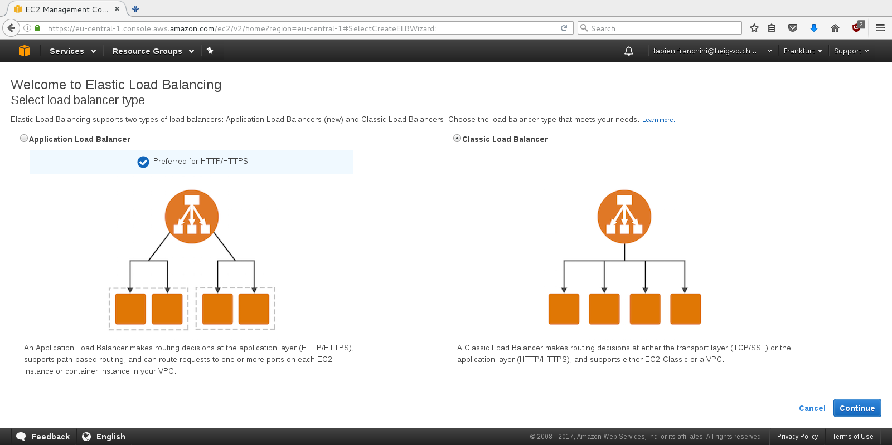

# LABORATOIRE 2 - ÉVOLUTIVITÉ D'UNE APPLICATION WEB SUR AWS

Lors du [précédent laboratoire](https://github.com/crabone/HEIGVD-CLD-2017-Labo-IaaS),
nous avions dû déployer une application web (Drupal 7) sur l'infrastructure de
cloud computing d'Amazon (AWS). Ici, nous allons rendre notre application web
évolutive (scalable) par l'utilisation du service web d'Amazon, RDS. De plus,
nous allons nous initier au principe de redondance par l'utilisation de
plusieurs instances EC2 et d'un repartisseur de charge (Load Balancer).

## ÉTUDIANTS

* FRANCHINI Fabien
* DONGMO NGOUMNAÏ Annie Sandra

## TÂCHE 1: CRÉATION D'UNE BASE DE DONNÉE RDS

Dans ce chapitre, nous allons préparer le terrain pour utiliser le service de
base de données relationnelles proposé par Amazon (RDS). Pour ce faire, nous
allons créer une instance spécifique à l'utilisation de base de données.

Premièrement, nous nous rendons sur le tableau de bord permettant de gérer les
instances RDS. Pour ce faire, dans la page d'accueil, il faut cliquer sur le
menu "RDS" de la catégorie "Database".


Avant de créer l'instance, nous souhaitons créer un "Security Group" adapté à
son utilisation, à savoir permettre les connexions entrantes par le port 3306.
Nous remarquons que le service permettant la création de groupes spécifiques
aux bases de données, n'est pas disponible pour notre région.


De ce fait, nous créons un "Security Group" traditionnel, nommé
"franchini-Drupal-DB". La procédure n'est pas détaillée dans ce chapitre (cf.
[Laboratoire n°1, tâche 2](https://github.com/crabone/HEIGVD-CLD-2017-Labo-IaaS#t%C3%82che-2-cr%C3%89ation-dune-instance-amazon-ec2)).


Maintenant que le "Security Group" a été créé, nous allons générer une nouvelle
instance RDS. Pour ce faire il faut retourner dans le tableau de bord prévu à
cet effet (cf. plus haut), ce rendre dans le sous-menu "Instance" et cliquer
sur "Launch DB Instance".


Nous sommes invités à choisir le type de base de données à employer. Ici nous
souhaitons utiliser une instance basée sur `MySQL`.


Comme cette procédure est expérimentale, nous ne choisissons pas de mettre en
production cette instance et nous utilisons à la place l'offre "Dev/Test".
L'offre "Production" permet notament de meilleures performances et un taux de
disponibilité plus élevé.


Ensuite, nous sommes invité à saisir les détails de l'instance, à savoir: Son
type, son identifiant et les crédentials liés à `MySQL`.


À cet instant, on choisi son "Security Group" (franchini-Drupal-DB) et
désactivons les sauvegardes automatiques. La désactivation des sauvegardes
automatiques se procède en spécifiant une fréquence de sauvegarde nulle.


Pour finir, nous confirmons la création de l'instance et prennons compte des
détails de configuration.


Nous apprenons que l'endpoint est identifié par le nom de domaine publique
`franchini-drupal.cm4237cqo8tv.eu-central-1.rds.amazonaws.com`.

Pour tester le bon déroulement de la manipulation nous tentons d'accèder à
cette nouvelle base de données, depuis l'instance contenant `drupal7` via le
client `mysql`. Pour ce faire nous passons en argument, l'endpoint et les
crédentials du compte `root`, précédément définis.

```
ubuntu@ip-172-31-3-176:~$ mysql --host=franchini-drupal.cm4237cqo8tv.eu-central-1.rds.amazonaws.com --user=root --password=<SECRET>
Welcome to the MySQL monitor.  Commands end with ; or \g.
Your MySQL connection id is 19
Server version: 5.6.27 MySQL Community Server (GPL)

Copyright (c) 2000, 2016, Oracle and/or its affiliates. All rights reserved.

Oracle is a registered trademark of Oracle Corporation and/or its
affiliates. Other names may be trademarks of their respective
owners.

Type 'help;' or '\h' for help. Type '\c' to clear the current input statement.

mysql> quit
Bye
```

Le client ne nous retourne pas d'erreur, tout est ok.

Maintenant nous nous interessons aux tarifs en vigueure par Amazon. Sur le [site
officiel](https://aws.amazon.com/rds/pricing/), nous apprenons qu'une instance
`db.t2.micro` est facturée 0.020$ par heure.


Avec l'utilitaire [Simple Monthly Calculator](http://calculator.s3.amazonaws.com/index.html),
nous apprenons que pour un mois, ce service nous couterait 15.33$.

**Note:** Il faut impérativement spécifier la région où sont généré les
instances. Les tarifs diffèrent d'une région à l'autre.


Si nous substituons ce service par l'utilisation d'une instance EC2 classique,
contenant une instance de `MySQL`. Nous payerons pour un mois, 10.25$


Bien qu'une instance EC2 soit moins cher, l'installation et la maintenance de
la base de donnée nous ait imputé. De ce fait, dans une optique "entreprise",
ces opérations représentent un coût non-négligeable (embauche d'un
administrateur compétent).

De plus, par souci de sécurité, nous recommandons l'utilisation du service RDS.
En effet, les temps de réaction d'Amazon pour patcher une base de donnée sont
plus rapide que si nous avons eu, nous même à le faire.

## TÂCHE 2: CONFIGURATION DE DRUPAL POUR L'UTILISATION D'UNE BASE DE DONNÉE RDS

Dans ce chapitre, nous allons reconfigurer `drupal7` pour l'utilisation d'une
base de données distante et migrer son contenu dans cette dernière.

### CHANGEMENT DE LA CONFIGURATION DE DRUPAL

Avant toute manipulation, nous devons stopper le serveur `apache2` afin d'éviter
tout désagrément.

```
ubuntu@ip-172-31-3-176:~$ sudo /etc/init.d/apache2 stop
 * Stopping web server apache2  
 *
```

Pour reconfigurer `drupal7` nous utilisons l'utilitaire `dpkg-reconfigure`.
`dpkg` est un système de gestion de paquets de bas niveau, utilisé dans les
distributions dérivant de Debian. Par analogie, nous citons `rpm`, utilitaire
similaire pour les distributions dérivant de Red Hat. Un utilisateur lambda
utilise généralement `apt`, qui est une surcouche de `dpkg`, pour gérer ses
paquets.

```
ubuntu@ip-172-31-3-176:~$ sudo dpkg-reconfigure drupal7
```

À présent, nous sommes invité à reconfigurer `drupal7` à l'aide d'une interface
graphique minimale (de type `ncurse` probablement).

Premièrement, on nous demande si nous voulons réinstaller la base de donnée.
Nous confirmons ce choix, étant donné que c'est notre intention première.


Nous choisissons le type de base de données, à savoir `MySQL`.


Nous sommes invités à saisir la méthode d'accès à la base de données distante.
Nous choisissons d'utiliser TCP/IP comme méthode de communication.


Ici, nous sommes invités à saisir le nom d'hôte du serveur distant, à savoir
l'endpoint obtenu dans la tâche précédente.


Nous spécifions le port d'accès, à savoir le port 3306.


À cet instant, nous devons saisir les credentials de l'administrateur de `MySQL`
(cf. [Tâche 1]()).


Maintenant, nous définissons quel utilisateur va gérer les tables liés à la
base de données propre à `drupal7`. Attention tout de même, cet utilisateur
n'est pas créé par cet utilitaire, nous préparons juste le cms. Il faudra par
la suite créer effectivement cet utilisateur dans la base de donnée et lui
accorder les droits appropriés.


Pour terminer nous saisissons le nom de la base de données qui contiendra les
données du CMS.


Nous affichons le fichier de configuration, nouvellement généré.

```
ubuntu@ip-172-31-8-194:~$ sudo cat /etc/drupal/7/sites/default/dbconfig.php
<?php
#
# database access settings in php format
# automatically generated from /etc/dbconfig-common/drupal7.conf
# by /usr/sbin/dbconfig-generate-include
#
# by default this file is managed via ucf, so you shouldn't have to
# worry about manual changes being silently discarded.  *however*,
# you'll probably also want to edit the configuration file mentioned
# above too.

$databases['default']['default'] = array(
	'driver' => 'mysql',
	'database' => 'drupal7',
	'username' => 'drupal7',
	'password' => '<SECRET_DRUPAL7>',
	'host' => 'franchini-drupal.cm4237cqo8tv.eu-central-1.rds.amazonaws.com',
	'port' => '',
	'prefix' => ''
);

?>
```

À présent, comme nous avons précédement spécifier un utilisateur (autre que
`root`) pour administrer la base de données, nous devons le créer effectivement.

Pour ce faire nous executons les instructions SQL fournis dans le devoir.

```
ubuntu@ip-172-31-3-176:~$ mysql --host=franchini-drupal.cm4237cqo8tv.eu-central-1.rds.amazonaws.com --user=root --password=<SECRET>
Welcome to the MySQL monitor.  Commands end with ; or \g.
Your MySQL connection id is 19
Server version: 5.6.27 MySQL Community Server (GPL)

Copyright (c) 2000, 2016, Oracle and/or its affiliates. All rights reserved.

Oracle is a registered trademark of Oracle Corporation and/or its
affiliates. Other names may be trademarks of their respective
owners.

Type 'help;' or '\h' for help. Type '\c' to clear the current input statement.

mysql> CREATE USER 'drupal7'@'%' IDENTIFIED BY '<SECRET_DRUPAL7>';
Query OK, 0 rows affected (0.00 sec)

mysql> GRANT SELECT, INSERT, UPDATE, DELETE, CREATE, DROP, INDEX, ALTER, CREATE TEMPORARY TABLES, LOCK TABLES ON drupal7.* TO 'drupal7'@'%' IDENTIFIED BY '<SECRET_DRUPAL7>';
Query OK, 0 rows affected (0.00 sec)

mysql> FLUSH PRIVILEGES;
Query OK, 0 rows affected (0.00 sec)

mysql> quit
Bye
```

Nous n'avons pas eu d'erreur, nous pouvons continuer la procédure.

### MIGRATION DE LA BASE DE DONNÉES

Maintenant, nous migrons le contenu de la base de donnée locale, qui a été
utilisée jusqu'à maintenant sur l'instance RDS distante.

```
ubuntu@ip-172-31-3-176:~$ mysqldump --add-drop-table --user=drupal7 --password=<SECRET_DRUPAL7> drupal7 |
  mysql --host=franchini-drupal.cm4237cqo8tv.eu-central-1.rds.amazonaws.com --user=drupal7 --password=<SECRET_DRUPAL7> drupal7
```

À présent, nous avons terminer notre migration. De ce fait, nous relançons le
serveur `apache2`.

```
$ sudo /etc/init.d/apache2 start
```

Nous nous rendons sur la page et constatons que tout fonctionne correctement.

## TÂCHE 3: CRÉATION D'UNE IMAGE VIRTUELLE PERSONNALISÉE

Dans ce chapitre, nous allons créer une **image** virtuelle personnalisée basée
sur l'instance EC2 contenant `drupal7`. Cette étape est nécessaire pour la
redondance de l'application. Ainsi nous pourrons déployer plusieurs instances de
l'application, dans différentes zones/régions proposées par Amazon.

Dans la terminologie d'Amazon, une image virtuelle se nomme: AMI.

Premièrement, il faut se rendre dans le tableau de bord permettant la gestion
des instances EC2. Après avoir sélectionné l'instance contenant l'application
web, nous déroulons le menu "Actions" et sélectionnons l'option permettant de
créer une image à partir de l'instance.


Ensuite, nous sommes invités à saisir les détails de l'image. Nous saisissons
son nom et sa description tel demandé dans l'énoncé du laboratoire.


Nous reçevons la confirmation que le processus de création de l'image est lancé.
À partir de ça, nous devons attendre quelques minutes pour sa création.


Pour voir si l'image a bien été créée, nous nous rendons dans le tableau de bord
approprié. Pour ce faire, il faut se rendre dans le sous-menu "AMIs" de la
catégorie "Images".


Nous avons la confirmation que l'image a bien été créée. Notons tout de même que
l'image est stocké dans la régions où elle a été créée ! Si nous désirons
déployer une instance EC2 basée sur cette image, dans une autre région, il
faudra impérativement copié l'image dans celle-çi.

## TÂCHE 4: CRÉATION D'UN LOAD BALANCER

Dans ce chapitre, nous allons créer un répartisseur de charge proposé par
Amazon (ELB). Pour plus d'information concernant son utilité, un [précédent
laboratoire](https://github.com/crabone/Teaching-HEIGVD-AIT-2015-Labo-02)
explique le fonctionnement global d'un répartisseur de charge.


Nous sommes invités à choisir le type de répartisseur de charge à utiliser. Ici,
nous choisissons l'offre classique, adaptée à nos besoin.



Ici, nous spécifions le nom de notre load balancer, à savoir "franchini-Drupal".


Maintenant, nous lui attribuons un "Security Group". Nous choisissons de
réutiliser "franchini-Drupal" bien qu'il soit un peu trop permissif.


Ensuite, nous devons configurer le "Health Check". Le répartisseur de charge
envoit périodiquement des requêtes à ses noeuds afin de savoir si ils sont
toujours "en vie". Nous considérons qu'un noeud est "en vie" si il répond, avec
succès, 2 "Health Check" à 10 secondes d'interval. De plus, nous spécifions,
arbitrairement le chemin d'accès du "Check" à `/drupal7/`.

**Note:** Nous aurions très bien pu faire pointer le "Health Check" à la racine
du serveur.


Nous lui attachons pour premier noeud, notre instance EC2 contenant
l'application web.


Nous confirmons nos choix et générons ainsi le répartisseur de charge.


Nous prenons en compte de son nom de domaine publique:
http://franchini-drupal-1520229052.eu-central-1.elb.amazonaws.com/drupal7/


```
[crab1@unknown ~]$ nslookup franchini-drupal-1520229052.eu-central-1.elb.amazonaws.com
Server:		130.125.1.111
Address:	130.125.1.111#53

Non-authoritative answer:
Name:	franchini-drupal-1520229052.eu-central-1.elb.amazonaws.com
Address: 35.157.254.178
Name:	franchini-drupal-1520229052.eu-central-1.elb.amazonaws.com
Address: 35.157.15.34
```

À présent, nous souhaitons observer les "Health Check" du répartisseur de charge
en regardant les logs l'instance contenant l'application web.

```
ubuntu@ip-172-31-30-195:~$ tail /var/log/apache2/access.log
172.31.9.229 - - [09/Mar/2017:13:43:42 +0000] "GET /drupal7/ HTTP/1.1" 200 9211 "-" "ELB-HealthChecker/1.0"
172.31.5.164 - - [09/Mar/2017:13:43:52 +0000] "GET /drupal7/ HTTP/1.1" 200 9211 "-" "ELB-HealthChecker/1.0"
172.31.26.187 - - [09/Mar/2017:13:43:52 +0000] "GET /drupal7/ HTTP/1.1" 200 9211 "-" "ELB-HealthChecker/1.0"
172.31.9.229 - - [09/Mar/2017:13:43:52 +0000] "GET /drupal7/ HTTP/1.1" 200 9211 "-" "ELB-HealthChecker/1.0"
172.31.5.164 - - [09/Mar/2017:13:44:02 +0000] "GET /drupal7/ HTTP/1.1" 200 9211 "-" "ELB-HealthChecker/1.0"
172.31.26.187 - - [09/Mar/2017:13:44:02 +0000] "GET /drupal7/ HTTP/1.1" 200 9211 "-" "ELB-HealthChecker/1.0"
172.31.9.229 - - [09/Mar/2017:13:44:02 +0000] "GET /drupal7/ HTTP/1.1" 200 9211 "-" "ELB-HealthChecker/1.0"
172.31.5.164 - - [09/Mar/2017:13:44:12 +0000] "GET /drupal7/ HTTP/1.1" 200 9211 "-" "ELB-HealthChecker/1.0"
172.31.26.187 - - [09/Mar/2017:13:44:12 +0000] "GET /drupal7/ HTTP/1.1" 200 9211 "-" "ELB-HealthChecker/1.0"
172.31.9.229 - - [09/Mar/2017:13:44:12 +0000] "GET /drupal7/ HTTP/1.1" 200 9211 "-" "ELB-HealthChecker/1.0"
```

**Note:** Comme nous avons mis en fonction un répartisseur de charge, nous
n'avons plus besoin d'utiliser une Elastic IP pour l'instance contenant
l'application web. (Procédure non-détaillée)

## TÂCHE 5: LANCEMENT D'UNE SECONDE INSTANCE DEPUIS LA NOUVELLE IMAGE

Dans ce chapitre, nous allons générer une seconde instance de l'application,
dans une zone différente de la première, à partir de l'image créée précédement.

Pour éviter une certaine redondance dans les explications, seules les étapes
importantes sont détaillées.

Premièrement, nous choisissons notre image personnalisée pour générer l'instance
EC2. Son occurence se trouve dans le menu "My AMIs".


Maintenant, nous devons spécifier une zone différente de notre première instance
EC2. Cette dernière se situe sur "eu-central-1b", de ce fait nous parametrons
la seconde sur "eu-central-1a".


Nous constatons que cette deuxième instance a bien été générée. Nous nous
rendons sur la page web de la seconde instance pour tester le bon déroulement de
la procédure. Tout est ok.


À présent, nous devons connecter cette seconde instance au repartisseur de
charge. Pour ce faire nous nous rendons dans le tableau de bord approprié.
Ensuite, dans le menu déroulant "Actions", il faut se rendre dans le menu
"Edit instances".


Nous selectionnons parmis toutes les instances disponible, celle précédement
généré.


Nous vérifions que l'instance à bien été associée.


Pas de problèmes à l'horizon.

Au final, nous obtenons une infrastructure pouvant être shématiser par un
diagramme.


À présent, nous nous interessons au coup total de l'infrastructure. Pour ce
faire, nous utilisons l'utilitaire [Simple Monthly Calculator](http://calculator.s3.amazonaws.com/index.html).

**Note:** Nous omettons volontairement le prix de l'Elastic IP, étant donnée la
présence du répartisseur de charge.


Nous constatons que notre infrastructure couterait 116.35$ par mois, soit
1396.2$ à l'année !

## TÂCHE 6: TEST DE L'APPLICATION DISTRIBUÉE

Dans ce chapitre, nous allons tester notre application distribuée. Nous voulous
connaître le comportement du répartisseur ainsi que le comportement des
instances face à charge élevée.

Premièrement nous activons la surveillance avancée de nos instances EC2 tel que
décrit dans l'énoncé. **(captures d'écran insdisponibles)**

Pour une meilleure lisibilité et surtout par curiosité nous créons un tableau de
bord. Pour ce faire, dans la page d'accueil il faut se rendre dans le sous-menu
"CloudWatch" de la catégorie "Managment Tools".

Ensuite, nous sommes invités à créer un nouveau tableau de bord.


Nous saisissons le nom du nouveau tableau de bord.


Une fois créer, nous ajustons la période de surveillance à 1 minute.


Nous ajoutons ensuite une nouvelle métrique. Nous choisissons de voir le nombre
de paquets entrants dans chacune des instances.


Par lisibilité, nous saisissons le nom plus parlant pour les instances.


Ensuite, toujours par souci de lisibilité nous restreignons la période
d'évaluation à une heure.


Maintenant nous configurons un nouveau plan de test. Pour ce faire on utilise le
logiciel `jmeter`.

Premièrement nous définissons un "Thread Group", c'est à dire un groupe
d'utilisateur.


Ensuite, nous définissons l'accès aux instance. Nous spécifions l'adresse du
répartisseur de charge, ainsi que le chemin d'accès `/drupal7/` par la méthode
GET.


Nous ouvrons en parallèle, deux terminaux avec une vue en temps réel des logs
générés par `apache2` pour chaque instance.


```
ubuntu@ip-172-31-8-194:~$ sudo grep -m5 -nr 500 /var/log/apache2/access.log
4680:172.31.9.229 - - [13/Mar/2017:12:18:38 +0000] "GET /drupal7/ HTTP/1.1" 500 4678 "-" "Apache-HttpClient/4.5.2 (Java/1.8.0_121)"
4701:172.31.9.229 - - [13/Mar/2017:12:18:39 +0000] "GET /drupal7/ HTTP/1.1" 500 4678 "-" "Apache-HttpClient/4.5.2 (Java/1.8.0_121)"
4703:172.31.9.229 - - [13/Mar/2017:12:18:39 +0000] "GET /drupal7/ HTTP/1.1" 500 4678 "-" "Apache-HttpClient/4.5.2 (Java/1.8.0_121)"
4706:172.31.9.229 - - [13/Mar/2017:12:18:39 +0000] "GET /drupal7/ HTTP/1.1" 500 4678 "-" "Apache-HttpClient/4.5.2 (Java/1.8.0_121)"
4708:172.31.9.229 - - [13/Mar/2017:12:18:39 +0000] "GET /drupal7/ HTTP/1.1" 500 4678 "-" "Apache-HttpClient/4.5.2 (Java/1.8.0_121)"
```

```
$ nslookup franchini-drupal-1520229052.eu-central-1.elb.amazonaws.com
Server:		130.125.1.111
Address:	130.125.1.111#53

Non-authoritative answer:
Name:	franchini-drupal-1520229052.eu-central-1.elb.amazonaws.com
Address: 35.157.15.34
Name:	franchini-drupal-1520229052.eu-central-1.elb.amazonaws.com
Address: 35.157.117.90
```

## TÂCHE 7: LIBÉRATION DES RESSOURCES

## CONCLUSION

Nous avons eu beaucoup de plaisir à découvrir les services web d'Amazon. Nous
constatons avec stupeur, le prix de l'infrastructure sur le long-terme. Si nous
avons à reproduire une infrastructure similaire, nous utiliserons les outils
en ligne de commande pour la déployer.
